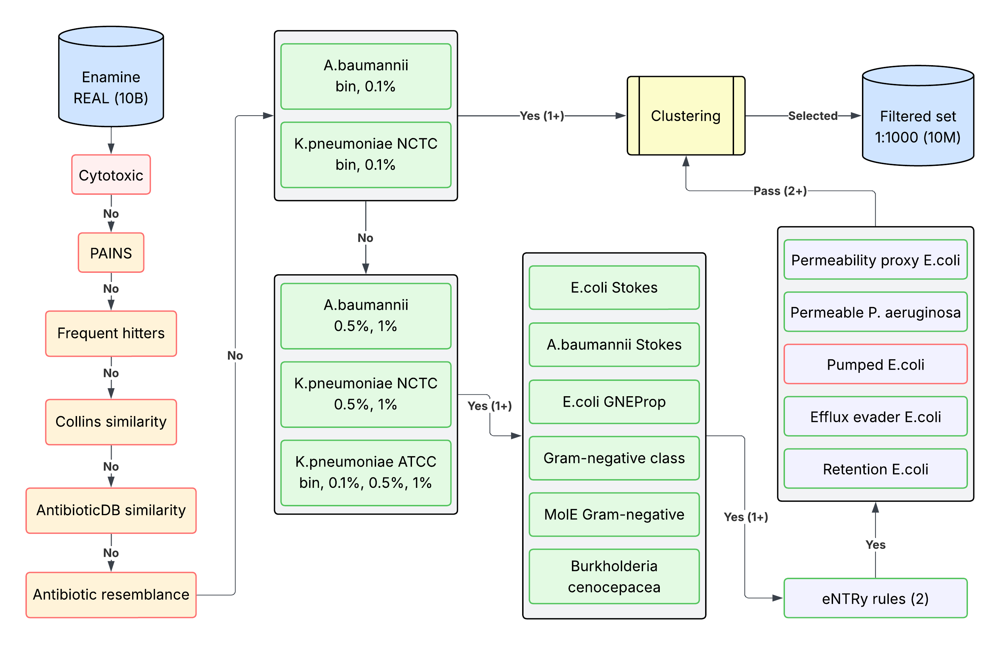

# GARDP K. pneumoniae Enamine REAL 10B screening

This repository facilitates the screening of Enamine REAL chunks using a lightweight prioritization pipeline for Gram-negative bacteria prediction.

## Background

This repository is based on a screening effort done in collaboration with GARDP and H3D. The screening is focused on _K. pneumoniae_ and _A. baumannii_ (Gram-negative) resistant strains.

- You can learn more about this work in this repository: https://github.com/ersilia-os/gardp-kpneumoniae (still private)
- The Enamine REAL space screened was stored using this code: https://github.com/ersilia-os/ready-to-screen-enamine-real

## Pipeline

Code in this repository does the following:

1. It downloads a chunk of Enamine REAL containing 10M compounds alongside their ECFP6 fingerprints (already pre-calculated). These files are stored in Ersilia's Google Drive, so a service file (JSON format) is necessary to download these files (see Important notes). In total, there are about 1000 chunks, i.e. ~10B molecules. the chunk identifiers can be found in [this file](data/chunks/chunks.csv).

2. A filtering of the chunk is performed using a pre-trained set of decision endpoints (see figure below).

3. A list of selected SMILES strings and Enamine identifiers is returned. Approximately, we aim at 1:1000 reduction for each chunk, but note that this is not guaranteed. Also, importantly, these virtual hits should not be treated as final, and accurate models should be used to further evaluate them.



## Usage

Clone this repository and create a Conda environment to install package requirements:

```bash
git clone https://github.com/ersilia-os/gardp-kpneumoniae-enamine-real-screening
cd gardp-kpneumoniae-enamine-real-screening

conda create -n gardp-kpn python=3.12
conda activate gardp-kpn
pip install -r requirements.txt
```

To run the pipeline, use the following command:

```bash
python src/run.py --chunk_name $CHUNK_NAME --output_dir $OUTPUT_DIR
```

Replace the placeholders:
- `$CHUNK_NAME`: Name of the chunk to be screened.
- `$OUTPUT_DIR`: Directory to save the output.

## Important notes

1. It is crucial that models (endpoints) are trained on **exactly** the same RDKit version (2025.09.1) that was used to store the Enamine fingerprints in Google Drive, using [the same](https://github.com/ersilia-os/ready-to-screen-enamine-real/blob/main/src/src.py) ECFP6 count featurization (radius 3, 2048 bits).

2. To download files from Ersilia's Google Drive, please download the corresponding service file (named `service.json`) from [Platform - Shared Credentials](https://drive.google.com/drive/folders/1OPHVrMaRF_90IeQsOld74pqCsWY-s-vH) and save it in `data/service` under the same name.

## About the Ersilia Open Source Initiative

The [Ersilia Open Source Initiative](https://ersilia.io) is a tech nonprofit organization dedicated to advancing sustainable research in the Global South. Their flagship resource, the [Ersilia Model Hub](https://github.com/ersilia-os/ersilia), is an open-source repository of AI/ML models designed for antimicrobial drug discovery.


